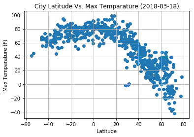
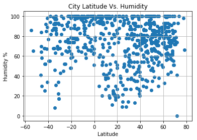
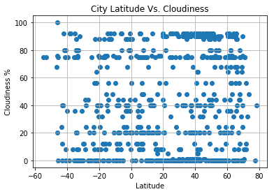
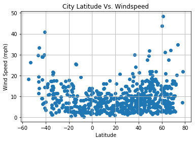

# WeatherPy

    # Observed Trend-1 :
        Its gets hotter, as you move closer to Equator
    # Observed Trend-2 :
        The windspeed is higer as you move away from Equator
    # Observed Trend-3 :
        The min Humidity% at Equator is higher than other cities far from equator. 


```python
#import required packages 
from citipy import citipy
import random
import csv
import matplotlib.pyplot as plt
import requests as req
import pandas as pd
import json
import time
import datetime
import configuration
```

# Generate Cities List


```python
x_coordinates = []
y_coordinates = []
cities = []
i=0
popped = 0
while (i<700):
    x_coordinates.append(random.uniform(-90.00, 90.00))
    y_coordinates.append(random.uniform(-180.00, 180.00)) 
    city = citipy.nearest_city(x_coordinates[i], y_coordinates[i])
    if city not in cities:
        cities.append(city)
        i=i+1
    else:
        popped = popped+1
        x_coordinates.pop()
        y_coordinates.pop()
#print('Total cities popped due to duplicate value : ' + str(popped))
#print(x_coordinates)   
#print(y_coordinates)
#for city in cities:
#    print(city.city_name)

print('Total cities :' + str(len(cities)))
```

    Total cities :700


# Perform API Calls


```python
api_key = configuration.api_key
url = "http://api.openweathermap.org/data/2.5/weather"
weather_data = []
parameters = {'appid': api_key,
              'units' : 'imperial'
             }


# Loop through the list of cities and perform a request for data on each
for city in cities:
    parameters['q'] = city.city_name
    try:
        query_url = url + '?appid=' + api_key + '&q=' + city.city_name
        print(query_url)
        weather_response = req.get(url, params=parameters)
        weather_response.raise_for_status()
        weather_json = weather_response.json()
        weather_data.append(weather_json)
    except:
        print('Error : Skipping this row '+ city.city_name)
    
    #weather_response = req.get(url, params=parameters)    
    #if weather_response.status_code == 200:
        #print(weather_response)
        #weather_json = weather_response.json()
        #weather_data.append(weather_json)

#print(json.dumps(weather_json, indent=4, sort_keys=True))

print('Weather data pulled for ' + str(len(weather_data)) + ' cities')

```

    http://api.openweathermap.org/data/2.5/weather?appid=23b0b3d461075d78b5c913a85150d150&q=rikitea
    http://api.openweathermap.org/data/2.5/weather?appid=23b0b3d461075d78b5c913a85150d150&q=tadine
    http://api.openweathermap.org/data/2.5/weather?appid=23b0b3d461075d78b5c913a85150d150&q=bredasdorp
    http://api.openweathermap.org/data/2.5/weather?appid=23b0b3d461075d78b5c913a85150d150&q=punta arenas
    http://api.openweathermap.org/data/2.5/weather?appid=23b0b3d461075d78b5c913a85150d150&q=ekuvukeni
    http://api.openweathermap.org/data/2.5/weather?appid=23b0b3d461075d78b5c913a85150d150&q=lebu
    http://api.openweathermap.org/data/2.5/weather?appid=23b0b3d461075d78b5c913a85150d150&q=dikson
    http://api.openweathermap.org/data/2.5/weather?appid=23b0b3d461075d78b5c913a85150d150&q=ola
    http://api.openweathermap.org/data/2.5/weather?appid=23b0b3d461075d78b5c913a85150d150&q=praia da vitoria
    http://api.openweathermap.org/data/2.5/weather?appid=23b0b3d461075d78b5c913a85150d150&q=tessalit
    http://api.openweathermap.org/data/2.5/weather?appid=23b0b3d461075d78b5c913a85150d150&q=norman wells
    http://api.openweathermap.org/data/2.5/weather?appid=23b0b3d461075d78b5c913a85150d150&q=octeville
    http://api.openweathermap.org/data/2.5/weather?appid=23b0b3d461075d78b5c913a85150d150&q=broome
    http://api.openweathermap.org/data/2.5/weather?appid=23b0b3d461075d78b5c913a85150d150&q=kapaa
    http://api.openweathermap.org/data/2.5/weather?appid=23b0b3d461075d78b5c913a85150d150&q=cape town
    http://api.openweathermap.org/data/2.5/weather?appid=23b0b3d461075d78b5c913a85150d150&q=camacha
    http://api.openweathermap.org/data/2.5/weather?appid=23b0b3d461075d78b5c913a85150d150&q=chingirlau
    http://api.openweathermap.org/data/2.5/weather?appid=23b0b3d461075d78b5c913a85150d150&q=askino
    http://api.openweathermap.org/data/2.5/weather?appid=23b0b3d461075d78b5c913a85150d150&q=luau
    http://api.openweathermap.org/data/2.5/weather?appid=23b0b3d461075d78b5c913a85150d150&q=port alfred
    http://api.openweathermap.org/data/2.5/weather?appid=23b0b3d461075d78b5c913a85150d150&q=tsihombe
    Error : Skipping this row tsihombe
    http://api.openweathermap.org/data/2.5/weather?appid=23b0b3d461075d78b5c913a85150d150&q=vaini
    http://api.openweathermap.org/data/2.5/weather?appid=23b0b3d461075d78b5c913a85150d150&q=olafsvik
    Error : Skipping this row olafsvik
    http://api.openweathermap.org/data/2.5/weather?appid=23b0b3d461075d78b5c913a85150d150&q=nenagh
    http://api.openweathermap.org/data/2.5/weather?appid=23b0b3d461075d78b5c913a85150d150&q=batemans bay
    http://api.openweathermap.org/data/2.5/weather?appid=23b0b3d461075d78b5c913a85150d150&q=busselton
    http://api.openweathermap.org/data/2.5/weather?appid=23b0b3d461075d78b5c913a85150d150&q=albany
    http://api.openweathermap.org/data/2.5/weather?appid=23b0b3d461075d78b5c913a85150d150&q=kamenka
    http://api.openweathermap.org/data/2.5/weather?appid=23b0b3d461075d78b5c913a85150d150&q=tasiilaq
    http://api.openweathermap.org/data/2.5/weather?appid=23b0b3d461075d78b5c913a85150d150&q=saint george
    http://api.openweathermap.org/data/2.5/weather?appid=23b0b3d461075d78b5c913a85150d150&q=lubango
    http://api.openweathermap.org/data/2.5/weather?appid=23b0b3d461075d78b5c913a85150d150&q=kuche
    Error : Skipping this row kuche
    http://api.openweathermap.org/data/2.5/weather?appid=23b0b3d461075d78b5c913a85150d150&q=dingle
    http://api.openweathermap.org/data/2.5/weather?appid=23b0b3d461075d78b5c913a85150d150&q=lagoa
    http://api.openweathermap.org/data/2.5/weather?appid=23b0b3d461075d78b5c913a85150d150&q=dekar
    http://api.openweathermap.org/data/2.5/weather?appid=23b0b3d461075d78b5c913a85150d150&q=mahebourg
    http://api.openweathermap.org/data/2.5/weather?appid=23b0b3d461075d78b5c913a85150d150&q=kasulu
    http://api.openweathermap.org/data/2.5/weather?appid=23b0b3d461075d78b5c913a85150d150&q=caravelas
    http://api.openweathermap.org/data/2.5/weather?appid=23b0b3d461075d78b5c913a85150d150&q=pervomayskoye
    http://api.openweathermap.org/data/2.5/weather?appid=23b0b3d461075d78b5c913a85150d150&q=castro
    http://api.openweathermap.org/data/2.5/weather?appid=23b0b3d461075d78b5c913a85150d150&q=ankang
    http://api.openweathermap.org/data/2.5/weather?appid=23b0b3d461075d78b5c913a85150d150&q=ushuaia
    http://api.openweathermap.org/data/2.5/weather?appid=23b0b3d461075d78b5c913a85150d150&q=thompson
    http://api.openweathermap.org/data/2.5/weather?appid=23b0b3d461075d78b5c913a85150d150&q=severomuysk
    http://api.openweathermap.org/data/2.5/weather?appid=23b0b3d461075d78b5c913a85150d150&q=deputatskiy
    http://api.openweathermap.org/data/2.5/weather?appid=23b0b3d461075d78b5c913a85150d150&q=mataura
    http://api.openweathermap.org/data/2.5/weather?appid=23b0b3d461075d78b5c913a85150d150&q=ambilobe
    http://api.openweathermap.org/data/2.5/weather?appid=23b0b3d461075d78b5c913a85150d150&q=naranjal
    http://api.openweathermap.org/data/2.5/weather?appid=23b0b3d461075d78b5c913a85150d150&q=mount gambier
    http://api.openweathermap.org/data/2.5/weather?appid=23b0b3d461075d78b5c913a85150d150&q=jamestown
    http://api.openweathermap.org/data/2.5/weather?appid=23b0b3d461075d78b5c913a85150d150&q=hobart
    http://api.openweathermap.org/data/2.5/weather?appid=23b0b3d461075d78b5c913a85150d150&q=butaritari
    http://api.openweathermap.org/data/2.5/weather?appid=23b0b3d461075d78b5c913a85150d150&q=labuhan
    http://api.openweathermap.org/data/2.5/weather?appid=23b0b3d461075d78b5c913a85150d150&q=saint-philippe
    http://api.openweathermap.org/data/2.5/weather?appid=23b0b3d461075d78b5c913a85150d150&q=fortuna
    http://api.openweathermap.org/data/2.5/weather?appid=23b0b3d461075d78b5c913a85150d150&q=bontang
    http://api.openweathermap.org/data/2.5/weather?appid=23b0b3d461075d78b5c913a85150d150&q=nanakuli
    http://api.openweathermap.org/data/2.5/weather?appid=23b0b3d461075d78b5c913a85150d150&q=hermanus
    http://api.openweathermap.org/data/2.5/weather?appid=23b0b3d461075d78b5c913a85150d150&q=bambous virieux
    http://api.openweathermap.org/data/2.5/weather?appid=23b0b3d461075d78b5c913a85150d150&q=amberley
    http://api.openweathermap.org/data/2.5/weather?appid=23b0b3d461075d78b5c913a85150d150&q=presidencia roque saenz pena
    http://api.openweathermap.org/data/2.5/weather?appid=23b0b3d461075d78b5c913a85150d150&q=antofagasta
    http://api.openweathermap.org/data/2.5/weather?appid=23b0b3d461075d78b5c913a85150d150&q=axim
    http://api.openweathermap.org/data/2.5/weather?appid=23b0b3d461075d78b5c913a85150d150&q=sur
    http://api.openweathermap.org/data/2.5/weather?appid=23b0b3d461075d78b5c913a85150d150&q=torbay
    http://api.openweathermap.org/data/2.5/weather?appid=23b0b3d461075d78b5c913a85150d150&q=nago
    http://api.openweathermap.org/data/2.5/weather?appid=23b0b3d461075d78b5c913a85150d150&q=igrim
    http://api.openweathermap.org/data/2.5/weather?appid=23b0b3d461075d78b5c913a85150d150&q=haines junction
    http://api.openweathermap.org/data/2.5/weather?appid=23b0b3d461075d78b5c913a85150d150&q=hofn
    http://api.openweathermap.org/data/2.5/weather?appid=23b0b3d461075d78b5c913a85150d150&q=yellowknife
    http://api.openweathermap.org/data/2.5/weather?appid=23b0b3d461075d78b5c913a85150d150&q=buffalo
    http://api.openweathermap.org/data/2.5/weather?appid=23b0b3d461075d78b5c913a85150d150&q=new norfolk
    http://api.openweathermap.org/data/2.5/weather?appid=23b0b3d461075d78b5c913a85150d150&q=vila velha
    http://api.openweathermap.org/data/2.5/weather?appid=23b0b3d461075d78b5c913a85150d150&q=ahipara
    http://api.openweathermap.org/data/2.5/weather?appid=23b0b3d461075d78b5c913a85150d150&q=mehamn
    http://api.openweathermap.org/data/2.5/weather?appid=23b0b3d461075d78b5c913a85150d150&q=atasu
    http://api.openweathermap.org/data/2.5/weather?appid=23b0b3d461075d78b5c913a85150d150&q=santiago
    http://api.openweathermap.org/data/2.5/weather?appid=23b0b3d461075d78b5c913a85150d150&q=zadar
    http://api.openweathermap.org/data/2.5/weather?appid=23b0b3d461075d78b5c913a85150d150&q=khasan
    http://api.openweathermap.org/data/2.5/weather?appid=23b0b3d461075d78b5c913a85150d150&q=mar del plata
    http://api.openweathermap.org/data/2.5/weather?appid=23b0b3d461075d78b5c913a85150d150&q=fort nelson
    http://api.openweathermap.org/data/2.5/weather?appid=23b0b3d461075d78b5c913a85150d150&q=hilo
    http://api.openweathermap.org/data/2.5/weather?appid=23b0b3d461075d78b5c913a85150d150&q=belushya guba
    Error : Skipping this row belushya guba
    http://api.openweathermap.org/data/2.5/weather?appid=23b0b3d461075d78b5c913a85150d150&q=illoqqortoormiut
    Error : Skipping this row illoqqortoormiut
    http://api.openweathermap.org/data/2.5/weather?appid=23b0b3d461075d78b5c913a85150d150&q=vaitupu
    Error : Skipping this row vaitupu
    http://api.openweathermap.org/data/2.5/weather?appid=23b0b3d461075d78b5c913a85150d150&q=nikolskoye
    http://api.openweathermap.org/data/2.5/weather?appid=23b0b3d461075d78b5c913a85150d150&q=kenai
    http://api.openweathermap.org/data/2.5/weather?appid=23b0b3d461075d78b5c913a85150d150&q=saskylakh
    http://api.openweathermap.org/data/2.5/weather?appid=23b0b3d461075d78b5c913a85150d150&q=tuktoyaktuk
    http://api.openweathermap.org/data/2.5/weather?appid=23b0b3d461075d78b5c913a85150d150&q=upernavik
    http://api.openweathermap.org/data/2.5/weather?appid=23b0b3d461075d78b5c913a85150d150&q=ginda
    http://api.openweathermap.org/data/2.5/weather?appid=23b0b3d461075d78b5c913a85150d150&q=houston
    http://api.openweathermap.org/data/2.5/weather?appid=23b0b3d461075d78b5c913a85150d150&q=barentsburg
    Error : Skipping this row barentsburg
    http://api.openweathermap.org/data/2.5/weather?appid=23b0b3d461075d78b5c913a85150d150&q=jiwani
    http://api.openweathermap.org/data/2.5/weather?appid=23b0b3d461075d78b5c913a85150d150&q=fez
    http://api.openweathermap.org/data/2.5/weather?appid=23b0b3d461075d78b5c913a85150d150&q=taolanaro
    Error : Skipping this row taolanaro
    http://api.openweathermap.org/data/2.5/weather?appid=23b0b3d461075d78b5c913a85150d150&q=barrow
    http://api.openweathermap.org/data/2.5/weather?appid=23b0b3d461075d78b5c913a85150d150&q=skibbereen
    http://api.openweathermap.org/data/2.5/weather?appid=23b0b3d461075d78b5c913a85150d150&q=umzimvubu
    Error : Skipping this row umzimvubu
    http://api.openweathermap.org/data/2.5/weather?appid=23b0b3d461075d78b5c913a85150d150&q=marcona
    Error : Skipping this row marcona
    http://api.openweathermap.org/data/2.5/weather?appid=23b0b3d461075d78b5c913a85150d150&q=ilulissat
    http://api.openweathermap.org/data/2.5/weather?appid=23b0b3d461075d78b5c913a85150d150&q=victoria
    http://api.openweathermap.org/data/2.5/weather?appid=23b0b3d461075d78b5c913a85150d150&q=kendari
    http://api.openweathermap.org/data/2.5/weather?appid=23b0b3d461075d78b5c913a85150d150&q=kaeo
    http://api.openweathermap.org/data/2.5/weather?appid=23b0b3d461075d78b5c913a85150d150&q=vila franca do campo
    http://api.openweathermap.org/data/2.5/weather?appid=23b0b3d461075d78b5c913a85150d150&q=lososina
    http://api.openweathermap.org/data/2.5/weather?appid=23b0b3d461075d78b5c913a85150d150&q=macaboboni
    Error : Skipping this row macaboboni
    http://api.openweathermap.org/data/2.5/weather?appid=23b0b3d461075d78b5c913a85150d150&q=margate
    http://api.openweathermap.org/data/2.5/weather?appid=23b0b3d461075d78b5c913a85150d150&q=sechura
    http://api.openweathermap.org/data/2.5/weather?appid=23b0b3d461075d78b5c913a85150d150&q=georgetown
    http://api.openweathermap.org/data/2.5/weather?appid=23b0b3d461075d78b5c913a85150d150&q=bluff
    http://api.openweathermap.org/data/2.5/weather?appid=23b0b3d461075d78b5c913a85150d150&q=vao
    http://api.openweathermap.org/data/2.5/weather?appid=23b0b3d461075d78b5c913a85150d150&q=bethel
    http://api.openweathermap.org/data/2.5/weather?appid=23b0b3d461075d78b5c913a85150d150&q=atuona
    http://api.openweathermap.org/data/2.5/weather?appid=23b0b3d461075d78b5c913a85150d150&q=ketchikan
    http://api.openweathermap.org/data/2.5/weather?appid=23b0b3d461075d78b5c913a85150d150&q=bilma
    http://api.openweathermap.org/data/2.5/weather?appid=23b0b3d461075d78b5c913a85150d150&q=fairbanks
    http://api.openweathermap.org/data/2.5/weather?appid=23b0b3d461075d78b5c913a85150d150&q=qaanaaq
    http://api.openweathermap.org/data/2.5/weather?appid=23b0b3d461075d78b5c913a85150d150&q=ancud
    http://api.openweathermap.org/data/2.5/weather?appid=23b0b3d461075d78b5c913a85150d150&q=altamira
    http://api.openweathermap.org/data/2.5/weather?appid=23b0b3d461075d78b5c913a85150d150&q=marienburg
    http://api.openweathermap.org/data/2.5/weather?appid=23b0b3d461075d78b5c913a85150d150&q=tuatapere
    http://api.openweathermap.org/data/2.5/weather?appid=23b0b3d461075d78b5c913a85150d150&q=ribas do rio pardo
    http://api.openweathermap.org/data/2.5/weather?appid=23b0b3d461075d78b5c913a85150d150&q=kaitangata
    http://api.openweathermap.org/data/2.5/weather?appid=23b0b3d461075d78b5c913a85150d150&q=isangel
    http://api.openweathermap.org/data/2.5/weather?appid=23b0b3d461075d78b5c913a85150d150&q=zhicheng
    http://api.openweathermap.org/data/2.5/weather?appid=23b0b3d461075d78b5c913a85150d150&q=lorengau
    http://api.openweathermap.org/data/2.5/weather?appid=23b0b3d461075d78b5c913a85150d150&q=kruisfontein
    http://api.openweathermap.org/data/2.5/weather?appid=23b0b3d461075d78b5c913a85150d150&q=maamba
    http://api.openweathermap.org/data/2.5/weather?appid=23b0b3d461075d78b5c913a85150d150&q=kahului
    http://api.openweathermap.org/data/2.5/weather?appid=23b0b3d461075d78b5c913a85150d150&q=maghama
    Error : Skipping this row maghama
    http://api.openweathermap.org/data/2.5/weather?appid=23b0b3d461075d78b5c913a85150d150&q=avarua
    http://api.openweathermap.org/data/2.5/weather?appid=23b0b3d461075d78b5c913a85150d150&q=kalmunai
    http://api.openweathermap.org/data/2.5/weather?appid=23b0b3d461075d78b5c913a85150d150&q=cidreira
    http://api.openweathermap.org/data/2.5/weather?appid=23b0b3d461075d78b5c913a85150d150&q=gashua
    http://api.openweathermap.org/data/2.5/weather?appid=23b0b3d461075d78b5c913a85150d150&q=rivadavia
    http://api.openweathermap.org/data/2.5/weather?appid=23b0b3d461075d78b5c913a85150d150&q=artyk
    Error : Skipping this row artyk
    http://api.openweathermap.org/data/2.5/weather?appid=23b0b3d461075d78b5c913a85150d150&q=longyearbyen
    http://api.openweathermap.org/data/2.5/weather?appid=23b0b3d461075d78b5c913a85150d150&q=inirida
    http://api.openweathermap.org/data/2.5/weather?appid=23b0b3d461075d78b5c913a85150d150&q=hasaki
    http://api.openweathermap.org/data/2.5/weather?appid=23b0b3d461075d78b5c913a85150d150&q=killybegs
    http://api.openweathermap.org/data/2.5/weather?appid=23b0b3d461075d78b5c913a85150d150&q=steinbach
    http://api.openweathermap.org/data/2.5/weather?appid=23b0b3d461075d78b5c913a85150d150&q=usinsk
    http://api.openweathermap.org/data/2.5/weather?appid=23b0b3d461075d78b5c913a85150d150&q=flinders
    http://api.openweathermap.org/data/2.5/weather?appid=23b0b3d461075d78b5c913a85150d150&q=paamiut
    http://api.openweathermap.org/data/2.5/weather?appid=23b0b3d461075d78b5c913a85150d150&q=ostrovnoy
    http://api.openweathermap.org/data/2.5/weather?appid=23b0b3d461075d78b5c913a85150d150&q=bocanda
    http://api.openweathermap.org/data/2.5/weather?appid=23b0b3d461075d78b5c913a85150d150&q=bonavista
    http://api.openweathermap.org/data/2.5/weather?appid=23b0b3d461075d78b5c913a85150d150&q=sobreira
    http://api.openweathermap.org/data/2.5/weather?appid=23b0b3d461075d78b5c913a85150d150&q=kununurra
    http://api.openweathermap.org/data/2.5/weather?appid=23b0b3d461075d78b5c913a85150d150&q=bilibino
    http://api.openweathermap.org/data/2.5/weather?appid=23b0b3d461075d78b5c913a85150d150&q=surt
    http://api.openweathermap.org/data/2.5/weather?appid=23b0b3d461075d78b5c913a85150d150&q=yulara
    http://api.openweathermap.org/data/2.5/weather?appid=23b0b3d461075d78b5c913a85150d150&q=kodiak
    http://api.openweathermap.org/data/2.5/weather?appid=23b0b3d461075d78b5c913a85150d150&q=talnakh
    http://api.openweathermap.org/data/2.5/weather?appid=23b0b3d461075d78b5c913a85150d150&q=lavrentiya
    http://api.openweathermap.org/data/2.5/weather?appid=23b0b3d461075d78b5c913a85150d150&q=ayni
    http://api.openweathermap.org/data/2.5/weather?appid=23b0b3d461075d78b5c913a85150d150&q=attawapiskat
    Error : Skipping this row attawapiskat
    http://api.openweathermap.org/data/2.5/weather?appid=23b0b3d461075d78b5c913a85150d150&q=port keats
    http://api.openweathermap.org/data/2.5/weather?appid=23b0b3d461075d78b5c913a85150d150&q=sigli
    http://api.openweathermap.org/data/2.5/weather?appid=23b0b3d461075d78b5c913a85150d150&q=clyde river
    http://api.openweathermap.org/data/2.5/weather?appid=23b0b3d461075d78b5c913a85150d150&q=sayaxche
    http://api.openweathermap.org/data/2.5/weather?appid=23b0b3d461075d78b5c913a85150d150&q=ponta do sol
    http://api.openweathermap.org/data/2.5/weather?appid=23b0b3d461075d78b5c913a85150d150&q=luanda
    http://api.openweathermap.org/data/2.5/weather?appid=23b0b3d461075d78b5c913a85150d150&q=morgan city
    http://api.openweathermap.org/data/2.5/weather?appid=23b0b3d461075d78b5c913a85150d150&q=beidao
    http://api.openweathermap.org/data/2.5/weather?appid=23b0b3d461075d78b5c913a85150d150&q=chokurdakh
    http://api.openweathermap.org/data/2.5/weather?appid=23b0b3d461075d78b5c913a85150d150&q=tiksi
    http://api.openweathermap.org/data/2.5/weather?appid=23b0b3d461075d78b5c913a85150d150&q=rorvik
    http://api.openweathermap.org/data/2.5/weather?appid=23b0b3d461075d78b5c913a85150d150&q=grindavik
    http://api.openweathermap.org/data/2.5/weather?appid=23b0b3d461075d78b5c913a85150d150&q=richards bay
    http://api.openweathermap.org/data/2.5/weather?appid=23b0b3d461075d78b5c913a85150d150&q=salitral
    http://api.openweathermap.org/data/2.5/weather?appid=23b0b3d461075d78b5c913a85150d150&q=airai
    http://api.openweathermap.org/data/2.5/weather?appid=23b0b3d461075d78b5c913a85150d150&q=whitehorse
    http://api.openweathermap.org/data/2.5/weather?appid=23b0b3d461075d78b5c913a85150d150&q=ilesha
    http://api.openweathermap.org/data/2.5/weather?appid=23b0b3d461075d78b5c913a85150d150&q=khartoum
    http://api.openweathermap.org/data/2.5/weather?appid=23b0b3d461075d78b5c913a85150d150&q=cabo san lucas
    http://api.openweathermap.org/data/2.5/weather?appid=23b0b3d461075d78b5c913a85150d150&q=ribeira grande
    http://api.openweathermap.org/data/2.5/weather?appid=23b0b3d461075d78b5c913a85150d150&q=port elizabeth
    http://api.openweathermap.org/data/2.5/weather?appid=23b0b3d461075d78b5c913a85150d150&q=sao filipe
    http://api.openweathermap.org/data/2.5/weather?appid=23b0b3d461075d78b5c913a85150d150&q=katangli
    http://api.openweathermap.org/data/2.5/weather?appid=23b0b3d461075d78b5c913a85150d150&q=kamaishi
    http://api.openweathermap.org/data/2.5/weather?appid=23b0b3d461075d78b5c913a85150d150&q=joshimath
    http://api.openweathermap.org/data/2.5/weather?appid=23b0b3d461075d78b5c913a85150d150&q=shiyan
    http://api.openweathermap.org/data/2.5/weather?appid=23b0b3d461075d78b5c913a85150d150&q=xichang
    http://api.openweathermap.org/data/2.5/weather?appid=23b0b3d461075d78b5c913a85150d150&q=alyangula
    http://api.openweathermap.org/data/2.5/weather?appid=23b0b3d461075d78b5c913a85150d150&q=jalingo
    http://api.openweathermap.org/data/2.5/weather?appid=23b0b3d461075d78b5c913a85150d150&q=tra vinh
    http://api.openweathermap.org/data/2.5/weather?appid=23b0b3d461075d78b5c913a85150d150&q=tiznit
    http://api.openweathermap.org/data/2.5/weather?appid=23b0b3d461075d78b5c913a85150d150&q=longhua
    http://api.openweathermap.org/data/2.5/weather?appid=23b0b3d461075d78b5c913a85150d150&q=laguna
    http://api.openweathermap.org/data/2.5/weather?appid=23b0b3d461075d78b5c913a85150d150&q=heihe
    http://api.openweathermap.org/data/2.5/weather?appid=23b0b3d461075d78b5c913a85150d150&q=goundam
    http://api.openweathermap.org/data/2.5/weather?appid=23b0b3d461075d78b5c913a85150d150&q=rosarito
    http://api.openweathermap.org/data/2.5/weather?appid=23b0b3d461075d78b5c913a85150d150&q=bira
    http://api.openweathermap.org/data/2.5/weather?appid=23b0b3d461075d78b5c913a85150d150&q=loviisa
    http://api.openweathermap.org/data/2.5/weather?appid=23b0b3d461075d78b5c913a85150d150&q=rio grande
    http://api.openweathermap.org/data/2.5/weather?appid=23b0b3d461075d78b5c913a85150d150&q=rocha
    http://api.openweathermap.org/data/2.5/weather?appid=23b0b3d461075d78b5c913a85150d150&q=naryan-mar
    http://api.openweathermap.org/data/2.5/weather?appid=23b0b3d461075d78b5c913a85150d150&q=aberdeen
    http://api.openweathermap.org/data/2.5/weather?appid=23b0b3d461075d78b5c913a85150d150&q=sisimiut
    http://api.openweathermap.org/data/2.5/weather?appid=23b0b3d461075d78b5c913a85150d150&q=yelizovo
    http://api.openweathermap.org/data/2.5/weather?appid=23b0b3d461075d78b5c913a85150d150&q=ganzhou
    http://api.openweathermap.org/data/2.5/weather?appid=23b0b3d461075d78b5c913a85150d150&q=pevek
    http://api.openweathermap.org/data/2.5/weather?appid=23b0b3d461075d78b5c913a85150d150&q=sattahip
    http://api.openweathermap.org/data/2.5/weather?appid=23b0b3d461075d78b5c913a85150d150&q=east london
    http://api.openweathermap.org/data/2.5/weather?appid=23b0b3d461075d78b5c913a85150d150&q=grand river south east
    Error : Skipping this row grand river south east
    http://api.openweathermap.org/data/2.5/weather?appid=23b0b3d461075d78b5c913a85150d150&q=bonthe
    http://api.openweathermap.org/data/2.5/weather?appid=23b0b3d461075d78b5c913a85150d150&q=ossora
    http://api.openweathermap.org/data/2.5/weather?appid=23b0b3d461075d78b5c913a85150d150&q=mamlyutka
    http://api.openweathermap.org/data/2.5/weather?appid=23b0b3d461075d78b5c913a85150d150&q=san rafael
    http://api.openweathermap.org/data/2.5/weather?appid=23b0b3d461075d78b5c913a85150d150&q=zhigansk
    http://api.openweathermap.org/data/2.5/weather?appid=23b0b3d461075d78b5c913a85150d150&q=kotovo
    http://api.openweathermap.org/data/2.5/weather?appid=23b0b3d461075d78b5c913a85150d150&q=kibre mengist
    http://api.openweathermap.org/data/2.5/weather?appid=23b0b3d461075d78b5c913a85150d150&q=kedrovyy
    http://api.openweathermap.org/data/2.5/weather?appid=23b0b3d461075d78b5c913a85150d150&q=bengkulu
    Error : Skipping this row bengkulu
    http://api.openweathermap.org/data/2.5/weather?appid=23b0b3d461075d78b5c913a85150d150&q=zacapu
    http://api.openweathermap.org/data/2.5/weather?appid=23b0b3d461075d78b5c913a85150d150&q=karaul
    Error : Skipping this row karaul
    http://api.openweathermap.org/data/2.5/weather?appid=23b0b3d461075d78b5c913a85150d150&q=mizdah
    http://api.openweathermap.org/data/2.5/weather?appid=23b0b3d461075d78b5c913a85150d150&q=rock sound
    http://api.openweathermap.org/data/2.5/weather?appid=23b0b3d461075d78b5c913a85150d150&q=suntar
    http://api.openweathermap.org/data/2.5/weather?appid=23b0b3d461075d78b5c913a85150d150&q=viligili
    Error : Skipping this row viligili
    http://api.openweathermap.org/data/2.5/weather?appid=23b0b3d461075d78b5c913a85150d150&q=nizhneyansk
    Error : Skipping this row nizhneyansk
    http://api.openweathermap.org/data/2.5/weather?appid=23b0b3d461075d78b5c913a85150d150&q=chuy
    http://api.openweathermap.org/data/2.5/weather?appid=23b0b3d461075d78b5c913a85150d150&q=honiara
    http://api.openweathermap.org/data/2.5/weather?appid=23b0b3d461075d78b5c913a85150d150&q=bagdarin
    http://api.openweathermap.org/data/2.5/weather?appid=23b0b3d461075d78b5c913a85150d150&q=faanui
    http://api.openweathermap.org/data/2.5/weather?appid=23b0b3d461075d78b5c913a85150d150&q=half moon bay
    http://api.openweathermap.org/data/2.5/weather?appid=23b0b3d461075d78b5c913a85150d150&q=dhupgari
    http://api.openweathermap.org/data/2.5/weather?appid=23b0b3d461075d78b5c913a85150d150&q=kidal
    http://api.openweathermap.org/data/2.5/weather?appid=23b0b3d461075d78b5c913a85150d150&q=nantucket
    http://api.openweathermap.org/data/2.5/weather?appid=23b0b3d461075d78b5c913a85150d150&q=palana
    http://api.openweathermap.org/data/2.5/weather?appid=23b0b3d461075d78b5c913a85150d150&q=ordzhonikidze
    http://api.openweathermap.org/data/2.5/weather?appid=23b0b3d461075d78b5c913a85150d150&q=belle fourche
    http://api.openweathermap.org/data/2.5/weather?appid=23b0b3d461075d78b5c913a85150d150&q=tabuk
    http://api.openweathermap.org/data/2.5/weather?appid=23b0b3d461075d78b5c913a85150d150&q=boca do acre
    http://api.openweathermap.org/data/2.5/weather?appid=23b0b3d461075d78b5c913a85150d150&q=nome
    http://api.openweathermap.org/data/2.5/weather?appid=23b0b3d461075d78b5c913a85150d150&q=luxeuil-les-bains
    http://api.openweathermap.org/data/2.5/weather?appid=23b0b3d461075d78b5c913a85150d150&q=pilar
    http://api.openweathermap.org/data/2.5/weather?appid=23b0b3d461075d78b5c913a85150d150&q=adrar
    http://api.openweathermap.org/data/2.5/weather?appid=23b0b3d461075d78b5c913a85150d150&q=aklavik
    http://api.openweathermap.org/data/2.5/weather?appid=23b0b3d461075d78b5c913a85150d150&q=inderborskiy
    Error : Skipping this row inderborskiy
    http://api.openweathermap.org/data/2.5/weather?appid=23b0b3d461075d78b5c913a85150d150&q=souillac
    http://api.openweathermap.org/data/2.5/weather?appid=23b0b3d461075d78b5c913a85150d150&q=marawi
    http://api.openweathermap.org/data/2.5/weather?appid=23b0b3d461075d78b5c913a85150d150&q=sao gabriel da cachoeira
    http://api.openweathermap.org/data/2.5/weather?appid=23b0b3d461075d78b5c913a85150d150&q=innisfail
    http://api.openweathermap.org/data/2.5/weather?appid=23b0b3d461075d78b5c913a85150d150&q=anadyr
    http://api.openweathermap.org/data/2.5/weather?appid=23b0b3d461075d78b5c913a85150d150&q=stephenville
    http://api.openweathermap.org/data/2.5/weather?appid=23b0b3d461075d78b5c913a85150d150&q=gao
    http://api.openweathermap.org/data/2.5/weather?appid=23b0b3d461075d78b5c913a85150d150&q=atar
    http://api.openweathermap.org/data/2.5/weather?appid=23b0b3d461075d78b5c913a85150d150&q=necochea
    http://api.openweathermap.org/data/2.5/weather?appid=23b0b3d461075d78b5c913a85150d150&q=carnarvon
    http://api.openweathermap.org/data/2.5/weather?appid=23b0b3d461075d78b5c913a85150d150&q=nyborg
    http://api.openweathermap.org/data/2.5/weather?appid=23b0b3d461075d78b5c913a85150d150&q=ouadda
    http://api.openweathermap.org/data/2.5/weather?appid=23b0b3d461075d78b5c913a85150d150&q=la ronge
    http://api.openweathermap.org/data/2.5/weather?appid=23b0b3d461075d78b5c913a85150d150&q=provideniya
    http://api.openweathermap.org/data/2.5/weather?appid=23b0b3d461075d78b5c913a85150d150&q=pacific grove
    http://api.openweathermap.org/data/2.5/weather?appid=23b0b3d461075d78b5c913a85150d150&q=arraial do cabo
    http://api.openweathermap.org/data/2.5/weather?appid=23b0b3d461075d78b5c913a85150d150&q=unity
    http://api.openweathermap.org/data/2.5/weather?appid=23b0b3d461075d78b5c913a85150d150&q=komsomolskiy
    http://api.openweathermap.org/data/2.5/weather?appid=23b0b3d461075d78b5c913a85150d150&q=abu samrah
    http://api.openweathermap.org/data/2.5/weather?appid=23b0b3d461075d78b5c913a85150d150&q=hami
    http://api.openweathermap.org/data/2.5/weather?appid=23b0b3d461075d78b5c913a85150d150&q=katsuura
    http://api.openweathermap.org/data/2.5/weather?appid=23b0b3d461075d78b5c913a85150d150&q=never
    http://api.openweathermap.org/data/2.5/weather?appid=23b0b3d461075d78b5c913a85150d150&q=yar-sale
    http://api.openweathermap.org/data/2.5/weather?appid=23b0b3d461075d78b5c913a85150d150&q=thinadhoo
    http://api.openweathermap.org/data/2.5/weather?appid=23b0b3d461075d78b5c913a85150d150&q=fernie
    http://api.openweathermap.org/data/2.5/weather?appid=23b0b3d461075d78b5c913a85150d150&q=port macquarie
    http://api.openweathermap.org/data/2.5/weather?appid=23b0b3d461075d78b5c913a85150d150&q=banyo
    http://api.openweathermap.org/data/2.5/weather?appid=23b0b3d461075d78b5c913a85150d150&q=padang
    http://api.openweathermap.org/data/2.5/weather?appid=23b0b3d461075d78b5c913a85150d150&q=aflu
    Error : Skipping this row aflu
    http://api.openweathermap.org/data/2.5/weather?appid=23b0b3d461075d78b5c913a85150d150&q=vestmanna
    http://api.openweathermap.org/data/2.5/weather?appid=23b0b3d461075d78b5c913a85150d150&q=beringovskiy
    http://api.openweathermap.org/data/2.5/weather?appid=23b0b3d461075d78b5c913a85150d150&q=dhidhdhoo
    http://api.openweathermap.org/data/2.5/weather?appid=23b0b3d461075d78b5c913a85150d150&q=saleaula
    Error : Skipping this row saleaula
    http://api.openweathermap.org/data/2.5/weather?appid=23b0b3d461075d78b5c913a85150d150&q=salta
    http://api.openweathermap.org/data/2.5/weather?appid=23b0b3d461075d78b5c913a85150d150&q=jalu
    http://api.openweathermap.org/data/2.5/weather?appid=23b0b3d461075d78b5c913a85150d150&q=khatanga
    http://api.openweathermap.org/data/2.5/weather?appid=23b0b3d461075d78b5c913a85150d150&q=luderitz
    http://api.openweathermap.org/data/2.5/weather?appid=23b0b3d461075d78b5c913a85150d150&q=pisco
    http://api.openweathermap.org/data/2.5/weather?appid=23b0b3d461075d78b5c913a85150d150&q=acarau
    Error : Skipping this row acarau
    http://api.openweathermap.org/data/2.5/weather?appid=23b0b3d461075d78b5c913a85150d150&q=guilin
    http://api.openweathermap.org/data/2.5/weather?appid=23b0b3d461075d78b5c913a85150d150&q=byron bay
    http://api.openweathermap.org/data/2.5/weather?appid=23b0b3d461075d78b5c913a85150d150&q=altagracia de orituco
    http://api.openweathermap.org/data/2.5/weather?appid=23b0b3d461075d78b5c913a85150d150&q=gizo
    http://api.openweathermap.org/data/2.5/weather?appid=23b0b3d461075d78b5c913a85150d150&q=maraba
    http://api.openweathermap.org/data/2.5/weather?appid=23b0b3d461075d78b5c913a85150d150&q=kemin
    http://api.openweathermap.org/data/2.5/weather?appid=23b0b3d461075d78b5c913a85150d150&q=khandyga
    http://api.openweathermap.org/data/2.5/weather?appid=23b0b3d461075d78b5c913a85150d150&q=nizwa
    http://api.openweathermap.org/data/2.5/weather?appid=23b0b3d461075d78b5c913a85150d150&q=yerbogachen
    http://api.openweathermap.org/data/2.5/weather?appid=23b0b3d461075d78b5c913a85150d150&q=ponca city
    http://api.openweathermap.org/data/2.5/weather?appid=23b0b3d461075d78b5c913a85150d150&q=utiroa
    Error : Skipping this row utiroa
    http://api.openweathermap.org/data/2.5/weather?appid=23b0b3d461075d78b5c913a85150d150&q=lorain
    http://api.openweathermap.org/data/2.5/weather?appid=23b0b3d461075d78b5c913a85150d150&q=waipawa
    http://api.openweathermap.org/data/2.5/weather?appid=23b0b3d461075d78b5c913a85150d150&q=constitucion
    http://api.openweathermap.org/data/2.5/weather?appid=23b0b3d461075d78b5c913a85150d150&q=viedma
    http://api.openweathermap.org/data/2.5/weather?appid=23b0b3d461075d78b5c913a85150d150&q=palo alto
    http://api.openweathermap.org/data/2.5/weather?appid=23b0b3d461075d78b5c913a85150d150&q=srednekolymsk
    http://api.openweathermap.org/data/2.5/weather?appid=23b0b3d461075d78b5c913a85150d150&q=bremerton
    http://api.openweathermap.org/data/2.5/weather?appid=23b0b3d461075d78b5c913a85150d150&q=vostok
    http://api.openweathermap.org/data/2.5/weather?appid=23b0b3d461075d78b5c913a85150d150&q=leningradskiy
    http://api.openweathermap.org/data/2.5/weather?appid=23b0b3d461075d78b5c913a85150d150&q=paoua
    http://api.openweathermap.org/data/2.5/weather?appid=23b0b3d461075d78b5c913a85150d150&q=maniitsoq
    http://api.openweathermap.org/data/2.5/weather?appid=23b0b3d461075d78b5c913a85150d150&q=golden
    http://api.openweathermap.org/data/2.5/weather?appid=23b0b3d461075d78b5c913a85150d150&q=staryy nadym
    http://api.openweathermap.org/data/2.5/weather?appid=23b0b3d461075d78b5c913a85150d150&q=quatre cocos
    http://api.openweathermap.org/data/2.5/weather?appid=23b0b3d461075d78b5c913a85150d150&q=oistins
    http://api.openweathermap.org/data/2.5/weather?appid=23b0b3d461075d78b5c913a85150d150&q=dekoa
    Error : Skipping this row dekoa
    http://api.openweathermap.org/data/2.5/weather?appid=23b0b3d461075d78b5c913a85150d150&q=kosh-agach
    http://api.openweathermap.org/data/2.5/weather?appid=23b0b3d461075d78b5c913a85150d150&q=dauphin
    http://api.openweathermap.org/data/2.5/weather?appid=23b0b3d461075d78b5c913a85150d150&q=hithadhoo
    http://api.openweathermap.org/data/2.5/weather?appid=23b0b3d461075d78b5c913a85150d150&q=spremberg
    http://api.openweathermap.org/data/2.5/weather?appid=23b0b3d461075d78b5c913a85150d150&q=junin
    http://api.openweathermap.org/data/2.5/weather?appid=23b0b3d461075d78b5c913a85150d150&q=charagua
    http://api.openweathermap.org/data/2.5/weather?appid=23b0b3d461075d78b5c913a85150d150&q=tabou
    http://api.openweathermap.org/data/2.5/weather?appid=23b0b3d461075d78b5c913a85150d150&q=touros
    http://api.openweathermap.org/data/2.5/weather?appid=23b0b3d461075d78b5c913a85150d150&q=znamensk
    http://api.openweathermap.org/data/2.5/weather?appid=23b0b3d461075d78b5c913a85150d150&q=santa isabel do rio negro
    http://api.openweathermap.org/data/2.5/weather?appid=23b0b3d461075d78b5c913a85150d150&q=palabuhanratu
    Error : Skipping this row palabuhanratu
    http://api.openweathermap.org/data/2.5/weather?appid=23b0b3d461075d78b5c913a85150d150&q=zapolyarnyy
    http://api.openweathermap.org/data/2.5/weather?appid=23b0b3d461075d78b5c913a85150d150&q=wick
    http://api.openweathermap.org/data/2.5/weather?appid=23b0b3d461075d78b5c913a85150d150&q=aljezur
    http://api.openweathermap.org/data/2.5/weather?appid=23b0b3d461075d78b5c913a85150d150&q=luorong
    http://api.openweathermap.org/data/2.5/weather?appid=23b0b3d461075d78b5c913a85150d150&q=samusu
    Error : Skipping this row samusu
    http://api.openweathermap.org/data/2.5/weather?appid=23b0b3d461075d78b5c913a85150d150&q=shchelkun
    http://api.openweathermap.org/data/2.5/weather?appid=23b0b3d461075d78b5c913a85150d150&q=trinidad
    http://api.openweathermap.org/data/2.5/weather?appid=23b0b3d461075d78b5c913a85150d150&q=tomatlan
    http://api.openweathermap.org/data/2.5/weather?appid=23b0b3d461075d78b5c913a85150d150&q=sumbe
    http://api.openweathermap.org/data/2.5/weather?appid=23b0b3d461075d78b5c913a85150d150&q=le port
    http://api.openweathermap.org/data/2.5/weather?appid=23b0b3d461075d78b5c913a85150d150&q=jilib
    http://api.openweathermap.org/data/2.5/weather?appid=23b0b3d461075d78b5c913a85150d150&q=bogande
    http://api.openweathermap.org/data/2.5/weather?appid=23b0b3d461075d78b5c913a85150d150&q=mandera
    http://api.openweathermap.org/data/2.5/weather?appid=23b0b3d461075d78b5c913a85150d150&q=tumbi
    http://api.openweathermap.org/data/2.5/weather?appid=23b0b3d461075d78b5c913a85150d150&q=havre-saint-pierre
    http://api.openweathermap.org/data/2.5/weather?appid=23b0b3d461075d78b5c913a85150d150&q=totness
    http://api.openweathermap.org/data/2.5/weather?appid=23b0b3d461075d78b5c913a85150d150&q=concepcion del oro
    http://api.openweathermap.org/data/2.5/weather?appid=23b0b3d461075d78b5c913a85150d150&q=mnogovershinnyy
    http://api.openweathermap.org/data/2.5/weather?appid=23b0b3d461075d78b5c913a85150d150&q=freeport
    http://api.openweathermap.org/data/2.5/weather?appid=23b0b3d461075d78b5c913a85150d150&q=lubao
    http://api.openweathermap.org/data/2.5/weather?appid=23b0b3d461075d78b5c913a85150d150&q=jian
    http://api.openweathermap.org/data/2.5/weather?appid=23b0b3d461075d78b5c913a85150d150&q=hornostayivka
    http://api.openweathermap.org/data/2.5/weather?appid=23b0b3d461075d78b5c913a85150d150&q=barra do garcas
    http://api.openweathermap.org/data/2.5/weather?appid=23b0b3d461075d78b5c913a85150d150&q=gerardmer
    http://api.openweathermap.org/data/2.5/weather?appid=23b0b3d461075d78b5c913a85150d150&q=anloga
    http://api.openweathermap.org/data/2.5/weather?appid=23b0b3d461075d78b5c913a85150d150&q=saldanha
    http://api.openweathermap.org/data/2.5/weather?appid=23b0b3d461075d78b5c913a85150d150&q=isola del liri
    http://api.openweathermap.org/data/2.5/weather?appid=23b0b3d461075d78b5c913a85150d150&q=najran
    http://api.openweathermap.org/data/2.5/weather?appid=23b0b3d461075d78b5c913a85150d150&q=noumea
    http://api.openweathermap.org/data/2.5/weather?appid=23b0b3d461075d78b5c913a85150d150&q=severo-kurilsk
    http://api.openweathermap.org/data/2.5/weather?appid=23b0b3d461075d78b5c913a85150d150&q=toktogul
    http://api.openweathermap.org/data/2.5/weather?appid=23b0b3d461075d78b5c913a85150d150&q=namibe
    http://api.openweathermap.org/data/2.5/weather?appid=23b0b3d461075d78b5c913a85150d150&q=bajo baudo
    Error : Skipping this row bajo baudo
    http://api.openweathermap.org/data/2.5/weather?appid=23b0b3d461075d78b5c913a85150d150&q=ojinaga
    http://api.openweathermap.org/data/2.5/weather?appid=23b0b3d461075d78b5c913a85150d150&q=gangapur
    http://api.openweathermap.org/data/2.5/weather?appid=23b0b3d461075d78b5c913a85150d150&q=mlonggo
    http://api.openweathermap.org/data/2.5/weather?appid=23b0b3d461075d78b5c913a85150d150&q=nanortalik
    http://api.openweathermap.org/data/2.5/weather?appid=23b0b3d461075d78b5c913a85150d150&q=mergui
    Error : Skipping this row mergui
    http://api.openweathermap.org/data/2.5/weather?appid=23b0b3d461075d78b5c913a85150d150&q=westport
    http://api.openweathermap.org/data/2.5/weather?appid=23b0b3d461075d78b5c913a85150d150&q=inhambane
    http://api.openweathermap.org/data/2.5/weather?appid=23b0b3d461075d78b5c913a85150d150&q=valdivia
    http://api.openweathermap.org/data/2.5/weather?appid=23b0b3d461075d78b5c913a85150d150&q=tecolutla
    http://api.openweathermap.org/data/2.5/weather?appid=23b0b3d461075d78b5c913a85150d150&q=aykhal
    http://api.openweathermap.org/data/2.5/weather?appid=23b0b3d461075d78b5c913a85150d150&q=iqaluit
    http://api.openweathermap.org/data/2.5/weather?appid=23b0b3d461075d78b5c913a85150d150&q=ucluelet
    http://api.openweathermap.org/data/2.5/weather?appid=23b0b3d461075d78b5c913a85150d150&q=mahadday weyne
    Error : Skipping this row mahadday weyne
    http://api.openweathermap.org/data/2.5/weather?appid=23b0b3d461075d78b5c913a85150d150&q=dzhusaly
    Error : Skipping this row dzhusaly
    http://api.openweathermap.org/data/2.5/weather?appid=23b0b3d461075d78b5c913a85150d150&q=kosino
    http://api.openweathermap.org/data/2.5/weather?appid=23b0b3d461075d78b5c913a85150d150&q=faya
    http://api.openweathermap.org/data/2.5/weather?appid=23b0b3d461075d78b5c913a85150d150&q=morondava
    http://api.openweathermap.org/data/2.5/weather?appid=23b0b3d461075d78b5c913a85150d150&q=mouzakion
    Error : Skipping this row mouzakion
    http://api.openweathermap.org/data/2.5/weather?appid=23b0b3d461075d78b5c913a85150d150&q=ballina
    http://api.openweathermap.org/data/2.5/weather?appid=23b0b3d461075d78b5c913a85150d150&q=jiddah
    Error : Skipping this row jiddah
    http://api.openweathermap.org/data/2.5/weather?appid=23b0b3d461075d78b5c913a85150d150&q=alekseyevsk
    http://api.openweathermap.org/data/2.5/weather?appid=23b0b3d461075d78b5c913a85150d150&q=fukue
    http://api.openweathermap.org/data/2.5/weather?appid=23b0b3d461075d78b5c913a85150d150&q=mosquera
    http://api.openweathermap.org/data/2.5/weather?appid=23b0b3d461075d78b5c913a85150d150&q=egvekinot
    http://api.openweathermap.org/data/2.5/weather?appid=23b0b3d461075d78b5c913a85150d150&q=sorland
    http://api.openweathermap.org/data/2.5/weather?appid=23b0b3d461075d78b5c913a85150d150&q=kahuta
    http://api.openweathermap.org/data/2.5/weather?appid=23b0b3d461075d78b5c913a85150d150&q=malatya
    Error : Skipping this row malatya
    http://api.openweathermap.org/data/2.5/weather?appid=23b0b3d461075d78b5c913a85150d150&q=hambantota
    http://api.openweathermap.org/data/2.5/weather?appid=23b0b3d461075d78b5c913a85150d150&q=tilichiki
    http://api.openweathermap.org/data/2.5/weather?appid=23b0b3d461075d78b5c913a85150d150&q=samarai
    http://api.openweathermap.org/data/2.5/weather?appid=23b0b3d461075d78b5c913a85150d150&q=zima
    http://api.openweathermap.org/data/2.5/weather?appid=23b0b3d461075d78b5c913a85150d150&q=esperance
    http://api.openweathermap.org/data/2.5/weather?appid=23b0b3d461075d78b5c913a85150d150&q=palauig
    http://api.openweathermap.org/data/2.5/weather?appid=23b0b3d461075d78b5c913a85150d150&q=kaoma
    http://api.openweathermap.org/data/2.5/weather?appid=23b0b3d461075d78b5c913a85150d150&q=pampa
    http://api.openweathermap.org/data/2.5/weather?appid=23b0b3d461075d78b5c913a85150d150&q=kudahuvadhoo
    http://api.openweathermap.org/data/2.5/weather?appid=23b0b3d461075d78b5c913a85150d150&q=miraflores
    http://api.openweathermap.org/data/2.5/weather?appid=23b0b3d461075d78b5c913a85150d150&q=diffa
    http://api.openweathermap.org/data/2.5/weather?appid=23b0b3d461075d78b5c913a85150d150&q=laramie
    http://api.openweathermap.org/data/2.5/weather?appid=23b0b3d461075d78b5c913a85150d150&q=amahai
    http://api.openweathermap.org/data/2.5/weather?appid=23b0b3d461075d78b5c913a85150d150&q=elban
    http://api.openweathermap.org/data/2.5/weather?appid=23b0b3d461075d78b5c913a85150d150&q=horsham
    http://api.openweathermap.org/data/2.5/weather?appid=23b0b3d461075d78b5c913a85150d150&q=verkhnedneprovskiy
    http://api.openweathermap.org/data/2.5/weather?appid=23b0b3d461075d78b5c913a85150d150&q=betioky
    Error : Skipping this row betioky
    http://api.openweathermap.org/data/2.5/weather?appid=23b0b3d461075d78b5c913a85150d150&q=nador
    http://api.openweathermap.org/data/2.5/weather?appid=23b0b3d461075d78b5c913a85150d150&q=north ridgeville
    http://api.openweathermap.org/data/2.5/weather?appid=23b0b3d461075d78b5c913a85150d150&q=canto do buriti
    http://api.openweathermap.org/data/2.5/weather?appid=23b0b3d461075d78b5c913a85150d150&q=ukiah
    http://api.openweathermap.org/data/2.5/weather?appid=23b0b3d461075d78b5c913a85150d150&q=itarema
    http://api.openweathermap.org/data/2.5/weather?appid=23b0b3d461075d78b5c913a85150d150&q=geraldton
    http://api.openweathermap.org/data/2.5/weather?appid=23b0b3d461075d78b5c913a85150d150&q=nuevo progreso
    http://api.openweathermap.org/data/2.5/weather?appid=23b0b3d461075d78b5c913a85150d150&q=omboue
    http://api.openweathermap.org/data/2.5/weather?appid=23b0b3d461075d78b5c913a85150d150&q=coquimbo
    http://api.openweathermap.org/data/2.5/weather?appid=23b0b3d461075d78b5c913a85150d150&q=katherine
    http://api.openweathermap.org/data/2.5/weather?appid=23b0b3d461075d78b5c913a85150d150&q=anito
    http://api.openweathermap.org/data/2.5/weather?appid=23b0b3d461075d78b5c913a85150d150&q=kavieng
    http://api.openweathermap.org/data/2.5/weather?appid=23b0b3d461075d78b5c913a85150d150&q=asau
    Error : Skipping this row asau
    http://api.openweathermap.org/data/2.5/weather?appid=23b0b3d461075d78b5c913a85150d150&q=simdega
    http://api.openweathermap.org/data/2.5/weather?appid=23b0b3d461075d78b5c913a85150d150&q=hirara
    http://api.openweathermap.org/data/2.5/weather?appid=23b0b3d461075d78b5c913a85150d150&q=kasane
    http://api.openweathermap.org/data/2.5/weather?appid=23b0b3d461075d78b5c913a85150d150&q=hualmay
    http://api.openweathermap.org/data/2.5/weather?appid=23b0b3d461075d78b5c913a85150d150&q=berlevag
    http://api.openweathermap.org/data/2.5/weather?appid=23b0b3d461075d78b5c913a85150d150&q=saint-denis
    http://api.openweathermap.org/data/2.5/weather?appid=23b0b3d461075d78b5c913a85150d150&q=sentyabrskiy
    Error : Skipping this row sentyabrskiy
    http://api.openweathermap.org/data/2.5/weather?appid=23b0b3d461075d78b5c913a85150d150&q=tuy hoa
    http://api.openweathermap.org/data/2.5/weather?appid=23b0b3d461075d78b5c913a85150d150&q=yanam
    http://api.openweathermap.org/data/2.5/weather?appid=23b0b3d461075d78b5c913a85150d150&q=riyadh
    http://api.openweathermap.org/data/2.5/weather?appid=23b0b3d461075d78b5c913a85150d150&q=port blair
    http://api.openweathermap.org/data/2.5/weather?appid=23b0b3d461075d78b5c913a85150d150&q=kabanjahe
    http://api.openweathermap.org/data/2.5/weather?appid=23b0b3d461075d78b5c913a85150d150&q=one hundred mile house
    Error : Skipping this row one hundred mile house
    http://api.openweathermap.org/data/2.5/weather?appid=23b0b3d461075d78b5c913a85150d150&q=araguaina
    http://api.openweathermap.org/data/2.5/weather?appid=23b0b3d461075d78b5c913a85150d150&q=maceio
    http://api.openweathermap.org/data/2.5/weather?appid=23b0b3d461075d78b5c913a85150d150&q=helong
    http://api.openweathermap.org/data/2.5/weather?appid=23b0b3d461075d78b5c913a85150d150&q=nampula
    http://api.openweathermap.org/data/2.5/weather?appid=23b0b3d461075d78b5c913a85150d150&q=shahrud
    http://api.openweathermap.org/data/2.5/weather?appid=23b0b3d461075d78b5c913a85150d150&q=pangnirtung
    http://api.openweathermap.org/data/2.5/weather?appid=23b0b3d461075d78b5c913a85150d150&q=amderma
    Error : Skipping this row amderma
    http://api.openweathermap.org/data/2.5/weather?appid=23b0b3d461075d78b5c913a85150d150&q=launceston
    http://api.openweathermap.org/data/2.5/weather?appid=23b0b3d461075d78b5c913a85150d150&q=vilyuysk
    http://api.openweathermap.org/data/2.5/weather?appid=23b0b3d461075d78b5c913a85150d150&q=prince rupert
    http://api.openweathermap.org/data/2.5/weather?appid=23b0b3d461075d78b5c913a85150d150&q=carazinho
    http://api.openweathermap.org/data/2.5/weather?appid=23b0b3d461075d78b5c913a85150d150&q=ihosy
    http://api.openweathermap.org/data/2.5/weather?appid=23b0b3d461075d78b5c913a85150d150&q=skovde
    Error : Skipping this row skovde
    http://api.openweathermap.org/data/2.5/weather?appid=23b0b3d461075d78b5c913a85150d150&q=salalah
    http://api.openweathermap.org/data/2.5/weather?appid=23b0b3d461075d78b5c913a85150d150&q=yenagoa
    http://api.openweathermap.org/data/2.5/weather?appid=23b0b3d461075d78b5c913a85150d150&q=pitimbu
    http://api.openweathermap.org/data/2.5/weather?appid=23b0b3d461075d78b5c913a85150d150&q=casper
    http://api.openweathermap.org/data/2.5/weather?appid=23b0b3d461075d78b5c913a85150d150&q=tautira
    http://api.openweathermap.org/data/2.5/weather?appid=23b0b3d461075d78b5c913a85150d150&q=yunguyo
    http://api.openweathermap.org/data/2.5/weather?appid=23b0b3d461075d78b5c913a85150d150&q=bahia blanca
    http://api.openweathermap.org/data/2.5/weather?appid=23b0b3d461075d78b5c913a85150d150&q=tabiauea
    Error : Skipping this row tabiauea
    http://api.openweathermap.org/data/2.5/weather?appid=23b0b3d461075d78b5c913a85150d150&q=ekhabi
    http://api.openweathermap.org/data/2.5/weather?appid=23b0b3d461075d78b5c913a85150d150&q=bubaque
    http://api.openweathermap.org/data/2.5/weather?appid=23b0b3d461075d78b5c913a85150d150&q=povenets
    http://api.openweathermap.org/data/2.5/weather?appid=23b0b3d461075d78b5c913a85150d150&q=karratha
    http://api.openweathermap.org/data/2.5/weather?appid=23b0b3d461075d78b5c913a85150d150&q=vanimo
    http://api.openweathermap.org/data/2.5/weather?appid=23b0b3d461075d78b5c913a85150d150&q=jumla
    http://api.openweathermap.org/data/2.5/weather?appid=23b0b3d461075d78b5c913a85150d150&q=le mars
    http://api.openweathermap.org/data/2.5/weather?appid=23b0b3d461075d78b5c913a85150d150&q=kelvington
    http://api.openweathermap.org/data/2.5/weather?appid=23b0b3d461075d78b5c913a85150d150&q=ayan
    http://api.openweathermap.org/data/2.5/weather?appid=23b0b3d461075d78b5c913a85150d150&q=burnie
    http://api.openweathermap.org/data/2.5/weather?appid=23b0b3d461075d78b5c913a85150d150&q=round rock
    http://api.openweathermap.org/data/2.5/weather?appid=23b0b3d461075d78b5c913a85150d150&q=falun
    http://api.openweathermap.org/data/2.5/weather?appid=23b0b3d461075d78b5c913a85150d150&q=oktyabrskoye
    http://api.openweathermap.org/data/2.5/weather?appid=23b0b3d461075d78b5c913a85150d150&q=highland
    http://api.openweathermap.org/data/2.5/weather?appid=23b0b3d461075d78b5c913a85150d150&q=mae hong son
    http://api.openweathermap.org/data/2.5/weather?appid=23b0b3d461075d78b5c913a85150d150&q=nimbahera
    http://api.openweathermap.org/data/2.5/weather?appid=23b0b3d461075d78b5c913a85150d150&q=parana
    http://api.openweathermap.org/data/2.5/weather?appid=23b0b3d461075d78b5c913a85150d150&q=phan thiet
    http://api.openweathermap.org/data/2.5/weather?appid=23b0b3d461075d78b5c913a85150d150&q=kachiry
    http://api.openweathermap.org/data/2.5/weather?appid=23b0b3d461075d78b5c913a85150d150&q=tucson
    http://api.openweathermap.org/data/2.5/weather?appid=23b0b3d461075d78b5c913a85150d150&q=palmer
    http://api.openweathermap.org/data/2.5/weather?appid=23b0b3d461075d78b5c913a85150d150&q=san patricio
    http://api.openweathermap.org/data/2.5/weather?appid=23b0b3d461075d78b5c913a85150d150&q=grottammare
    http://api.openweathermap.org/data/2.5/weather?appid=23b0b3d461075d78b5c913a85150d150&q=kyshtovka
    http://api.openweathermap.org/data/2.5/weather?appid=23b0b3d461075d78b5c913a85150d150&q=aden
    http://api.openweathermap.org/data/2.5/weather?appid=23b0b3d461075d78b5c913a85150d150&q=bolungarvik
    Error : Skipping this row bolungarvik
    http://api.openweathermap.org/data/2.5/weather?appid=23b0b3d461075d78b5c913a85150d150&q=marsabit
    http://api.openweathermap.org/data/2.5/weather?appid=23b0b3d461075d78b5c913a85150d150&q=vieux-habitants
    http://api.openweathermap.org/data/2.5/weather?appid=23b0b3d461075d78b5c913a85150d150&q=zinder
    http://api.openweathermap.org/data/2.5/weather?appid=23b0b3d461075d78b5c913a85150d150&q=narsaq
    http://api.openweathermap.org/data/2.5/weather?appid=23b0b3d461075d78b5c913a85150d150&q=slyudyanka
    http://api.openweathermap.org/data/2.5/weather?appid=23b0b3d461075d78b5c913a85150d150&q=hamilton
    http://api.openweathermap.org/data/2.5/weather?appid=23b0b3d461075d78b5c913a85150d150&q=bathsheba
    http://api.openweathermap.org/data/2.5/weather?appid=23b0b3d461075d78b5c913a85150d150&q=bullhead city
    http://api.openweathermap.org/data/2.5/weather?appid=23b0b3d461075d78b5c913a85150d150&q=newport
    http://api.openweathermap.org/data/2.5/weather?appid=23b0b3d461075d78b5c913a85150d150&q=kemijarvi
    Error : Skipping this row kemijarvi
    http://api.openweathermap.org/data/2.5/weather?appid=23b0b3d461075d78b5c913a85150d150&q=dien bien
    Error : Skipping this row dien bien
    http://api.openweathermap.org/data/2.5/weather?appid=23b0b3d461075d78b5c913a85150d150&q=belfast
    http://api.openweathermap.org/data/2.5/weather?appid=23b0b3d461075d78b5c913a85150d150&q=college
    http://api.openweathermap.org/data/2.5/weather?appid=23b0b3d461075d78b5c913a85150d150&q=los llanos de aridane
    http://api.openweathermap.org/data/2.5/weather?appid=23b0b3d461075d78b5c913a85150d150&q=beloha
    http://api.openweathermap.org/data/2.5/weather?appid=23b0b3d461075d78b5c913a85150d150&q=hermiston
    http://api.openweathermap.org/data/2.5/weather?appid=23b0b3d461075d78b5c913a85150d150&q=guerrero negro
    http://api.openweathermap.org/data/2.5/weather?appid=23b0b3d461075d78b5c913a85150d150&q=haibowan
    Error : Skipping this row haibowan
    http://api.openweathermap.org/data/2.5/weather?appid=23b0b3d461075d78b5c913a85150d150&q=cockburn town
    http://api.openweathermap.org/data/2.5/weather?appid=23b0b3d461075d78b5c913a85150d150&q=korla
    Error : Skipping this row korla
    http://api.openweathermap.org/data/2.5/weather?appid=23b0b3d461075d78b5c913a85150d150&q=tumannyy
    Error : Skipping this row tumannyy
    http://api.openweathermap.org/data/2.5/weather?appid=23b0b3d461075d78b5c913a85150d150&q=alofi
    http://api.openweathermap.org/data/2.5/weather?appid=23b0b3d461075d78b5c913a85150d150&q=qingyuan
    http://api.openweathermap.org/data/2.5/weather?appid=23b0b3d461075d78b5c913a85150d150&q=chapais
    http://api.openweathermap.org/data/2.5/weather?appid=23b0b3d461075d78b5c913a85150d150&q=eureka
    http://api.openweathermap.org/data/2.5/weather?appid=23b0b3d461075d78b5c913a85150d150&q=kiunga
    http://api.openweathermap.org/data/2.5/weather?appid=23b0b3d461075d78b5c913a85150d150&q=weligama
    http://api.openweathermap.org/data/2.5/weather?appid=23b0b3d461075d78b5c913a85150d150&q=sao joao da barra
    http://api.openweathermap.org/data/2.5/weather?appid=23b0b3d461075d78b5c913a85150d150&q=tongliao
    http://api.openweathermap.org/data/2.5/weather?appid=23b0b3d461075d78b5c913a85150d150&q=mitu
    http://api.openweathermap.org/data/2.5/weather?appid=23b0b3d461075d78b5c913a85150d150&q=galiwinku
    Error : Skipping this row galiwinku
    http://api.openweathermap.org/data/2.5/weather?appid=23b0b3d461075d78b5c913a85150d150&q=sitka
    http://api.openweathermap.org/data/2.5/weather?appid=23b0b3d461075d78b5c913a85150d150&q=evensk
    http://api.openweathermap.org/data/2.5/weather?appid=23b0b3d461075d78b5c913a85150d150&q=coahuayana
    http://api.openweathermap.org/data/2.5/weather?appid=23b0b3d461075d78b5c913a85150d150&q=zilupe
    http://api.openweathermap.org/data/2.5/weather?appid=23b0b3d461075d78b5c913a85150d150&q=grass valley
    http://api.openweathermap.org/data/2.5/weather?appid=23b0b3d461075d78b5c913a85150d150&q=samagaltay
    http://api.openweathermap.org/data/2.5/weather?appid=23b0b3d461075d78b5c913a85150d150&q=olinda
    http://api.openweathermap.org/data/2.5/weather?appid=23b0b3d461075d78b5c913a85150d150&q=praia
    http://api.openweathermap.org/data/2.5/weather?appid=23b0b3d461075d78b5c913a85150d150&q=nokaneng
    http://api.openweathermap.org/data/2.5/weather?appid=23b0b3d461075d78b5c913a85150d150&q=la tuque
    http://api.openweathermap.org/data/2.5/weather?appid=23b0b3d461075d78b5c913a85150d150&q=port hedland
    http://api.openweathermap.org/data/2.5/weather?appid=23b0b3d461075d78b5c913a85150d150&q=biak
    http://api.openweathermap.org/data/2.5/weather?appid=23b0b3d461075d78b5c913a85150d150&q=kieta
    http://api.openweathermap.org/data/2.5/weather?appid=23b0b3d461075d78b5c913a85150d150&q=knysna
    http://api.openweathermap.org/data/2.5/weather?appid=23b0b3d461075d78b5c913a85150d150&q=nuuk
    http://api.openweathermap.org/data/2.5/weather?appid=23b0b3d461075d78b5c913a85150d150&q=nueva concepcion
    http://api.openweathermap.org/data/2.5/weather?appid=23b0b3d461075d78b5c913a85150d150&q=ligayan
    http://api.openweathermap.org/data/2.5/weather?appid=23b0b3d461075d78b5c913a85150d150&q=longview
    http://api.openweathermap.org/data/2.5/weather?appid=23b0b3d461075d78b5c913a85150d150&q=leshukonskoye
    http://api.openweathermap.org/data/2.5/weather?appid=23b0b3d461075d78b5c913a85150d150&q=gamba
    http://api.openweathermap.org/data/2.5/weather?appid=23b0b3d461075d78b5c913a85150d150&q=san rafael del sur
    http://api.openweathermap.org/data/2.5/weather?appid=23b0b3d461075d78b5c913a85150d150&q=baoqing
    http://api.openweathermap.org/data/2.5/weather?appid=23b0b3d461075d78b5c913a85150d150&q=unye
    Error : Skipping this row unye
    http://api.openweathermap.org/data/2.5/weather?appid=23b0b3d461075d78b5c913a85150d150&q=kichera
    http://api.openweathermap.org/data/2.5/weather?appid=23b0b3d461075d78b5c913a85150d150&q=trelew
    http://api.openweathermap.org/data/2.5/weather?appid=23b0b3d461075d78b5c913a85150d150&q=comodoro rivadavia
    http://api.openweathermap.org/data/2.5/weather?appid=23b0b3d461075d78b5c913a85150d150&q=champerico
    http://api.openweathermap.org/data/2.5/weather?appid=23b0b3d461075d78b5c913a85150d150&q=santo antonio do ica
    http://api.openweathermap.org/data/2.5/weather?appid=23b0b3d461075d78b5c913a85150d150&q=gornopravdinsk
    http://api.openweathermap.org/data/2.5/weather?appid=23b0b3d461075d78b5c913a85150d150&q=sarahan
    http://api.openweathermap.org/data/2.5/weather?appid=23b0b3d461075d78b5c913a85150d150&q=kushiro
    http://api.openweathermap.org/data/2.5/weather?appid=23b0b3d461075d78b5c913a85150d150&q=broken hill
    http://api.openweathermap.org/data/2.5/weather?appid=23b0b3d461075d78b5c913a85150d150&q=basudebpur
    http://api.openweathermap.org/data/2.5/weather?appid=23b0b3d461075d78b5c913a85150d150&q=villa carlos paz
    http://api.openweathermap.org/data/2.5/weather?appid=23b0b3d461075d78b5c913a85150d150&q=plouzane
    http://api.openweathermap.org/data/2.5/weather?appid=23b0b3d461075d78b5c913a85150d150&q=vyshestebliyevskaya
    http://api.openweathermap.org/data/2.5/weather?appid=23b0b3d461075d78b5c913a85150d150&q=victor harbor
    http://api.openweathermap.org/data/2.5/weather?appid=23b0b3d461075d78b5c913a85150d150&q=gorkovskoye
    Error : Skipping this row gorkovskoye
    http://api.openweathermap.org/data/2.5/weather?appid=23b0b3d461075d78b5c913a85150d150&q=chipinge
    http://api.openweathermap.org/data/2.5/weather?appid=23b0b3d461075d78b5c913a85150d150&q=cantagallo
    http://api.openweathermap.org/data/2.5/weather?appid=23b0b3d461075d78b5c913a85150d150&q=kodra
    http://api.openweathermap.org/data/2.5/weather?appid=23b0b3d461075d78b5c913a85150d150&q=puerto ayora
    http://api.openweathermap.org/data/2.5/weather?appid=23b0b3d461075d78b5c913a85150d150&q=bitkine
    http://api.openweathermap.org/data/2.5/weather?appid=23b0b3d461075d78b5c913a85150d150&q=san cristobal
    http://api.openweathermap.org/data/2.5/weather?appid=23b0b3d461075d78b5c913a85150d150&q=hereford
    http://api.openweathermap.org/data/2.5/weather?appid=23b0b3d461075d78b5c913a85150d150&q=ruatoria
    Error : Skipping this row ruatoria
    http://api.openweathermap.org/data/2.5/weather?appid=23b0b3d461075d78b5c913a85150d150&q=mareeba
    http://api.openweathermap.org/data/2.5/weather?appid=23b0b3d461075d78b5c913a85150d150&q=san jeronimo
    http://api.openweathermap.org/data/2.5/weather?appid=23b0b3d461075d78b5c913a85150d150&q=ivybridge
    http://api.openweathermap.org/data/2.5/weather?appid=23b0b3d461075d78b5c913a85150d150&q=sinnamary
    http://api.openweathermap.org/data/2.5/weather?appid=23b0b3d461075d78b5c913a85150d150&q=tumpat
    http://api.openweathermap.org/data/2.5/weather?appid=23b0b3d461075d78b5c913a85150d150&q=mercedes
    http://api.openweathermap.org/data/2.5/weather?appid=23b0b3d461075d78b5c913a85150d150&q=acoua
    http://api.openweathermap.org/data/2.5/weather?appid=23b0b3d461075d78b5c913a85150d150&q=klaksvik
    http://api.openweathermap.org/data/2.5/weather?appid=23b0b3d461075d78b5c913a85150d150&q=gombong
    http://api.openweathermap.org/data/2.5/weather?appid=23b0b3d461075d78b5c913a85150d150&q=plettenberg bay
    http://api.openweathermap.org/data/2.5/weather?appid=23b0b3d461075d78b5c913a85150d150&q=el tejar
    http://api.openweathermap.org/data/2.5/weather?appid=23b0b3d461075d78b5c913a85150d150&q=cherskiy
    http://api.openweathermap.org/data/2.5/weather?appid=23b0b3d461075d78b5c913a85150d150&q=casablanca
    http://api.openweathermap.org/data/2.5/weather?appid=23b0b3d461075d78b5c913a85150d150&q=fort wellington
    http://api.openweathermap.org/data/2.5/weather?appid=23b0b3d461075d78b5c913a85150d150&q=bandarbeyla
    http://api.openweathermap.org/data/2.5/weather?appid=23b0b3d461075d78b5c913a85150d150&q=venado tuerto
    http://api.openweathermap.org/data/2.5/weather?appid=23b0b3d461075d78b5c913a85150d150&q=kuli
    http://api.openweathermap.org/data/2.5/weather?appid=23b0b3d461075d78b5c913a85150d150&q=ushtobe
    http://api.openweathermap.org/data/2.5/weather?appid=23b0b3d461075d78b5c913a85150d150&q=poum
    http://api.openweathermap.org/data/2.5/weather?appid=23b0b3d461075d78b5c913a85150d150&q=vanavara
    http://api.openweathermap.org/data/2.5/weather?appid=23b0b3d461075d78b5c913a85150d150&q=taybad
    http://api.openweathermap.org/data/2.5/weather?appid=23b0b3d461075d78b5c913a85150d150&q=orlik
    http://api.openweathermap.org/data/2.5/weather?appid=23b0b3d461075d78b5c913a85150d150&q=dillingen
    http://api.openweathermap.org/data/2.5/weather?appid=23b0b3d461075d78b5c913a85150d150&q=dasoguz
    http://api.openweathermap.org/data/2.5/weather?appid=23b0b3d461075d78b5c913a85150d150&q=nyurba
    http://api.openweathermap.org/data/2.5/weather?appid=23b0b3d461075d78b5c913a85150d150&q=luwuk
    http://api.openweathermap.org/data/2.5/weather?appid=23b0b3d461075d78b5c913a85150d150&q=vulturesti
    http://api.openweathermap.org/data/2.5/weather?appid=23b0b3d461075d78b5c913a85150d150&q=treinta y tres
    http://api.openweathermap.org/data/2.5/weather?appid=23b0b3d461075d78b5c913a85150d150&q=nizhniy chir
    http://api.openweathermap.org/data/2.5/weather?appid=23b0b3d461075d78b5c913a85150d150&q=requena
    http://api.openweathermap.org/data/2.5/weather?appid=23b0b3d461075d78b5c913a85150d150&q=itamaraca
    http://api.openweathermap.org/data/2.5/weather?appid=23b0b3d461075d78b5c913a85150d150&q=ahuimanu
    http://api.openweathermap.org/data/2.5/weather?appid=23b0b3d461075d78b5c913a85150d150&q=corbu
    http://api.openweathermap.org/data/2.5/weather?appid=23b0b3d461075d78b5c913a85150d150&q=san quintin
    http://api.openweathermap.org/data/2.5/weather?appid=23b0b3d461075d78b5c913a85150d150&q=harnosand
    http://api.openweathermap.org/data/2.5/weather?appid=23b0b3d461075d78b5c913a85150d150&q=bud
    http://api.openweathermap.org/data/2.5/weather?appid=23b0b3d461075d78b5c913a85150d150&q=port hawkesbury
    http://api.openweathermap.org/data/2.5/weather?appid=23b0b3d461075d78b5c913a85150d150&q=cassilandia
    http://api.openweathermap.org/data/2.5/weather?appid=23b0b3d461075d78b5c913a85150d150&q=muros
    http://api.openweathermap.org/data/2.5/weather?appid=23b0b3d461075d78b5c913a85150d150&q=walvis bay
    http://api.openweathermap.org/data/2.5/weather?appid=23b0b3d461075d78b5c913a85150d150&q=valasske mezirici
    http://api.openweathermap.org/data/2.5/weather?appid=23b0b3d461075d78b5c913a85150d150&q=takaka
    http://api.openweathermap.org/data/2.5/weather?appid=23b0b3d461075d78b5c913a85150d150&q=oussouye
    http://api.openweathermap.org/data/2.5/weather?appid=23b0b3d461075d78b5c913a85150d150&q=filiatra
    http://api.openweathermap.org/data/2.5/weather?appid=23b0b3d461075d78b5c913a85150d150&q=chongwe
    http://api.openweathermap.org/data/2.5/weather?appid=23b0b3d461075d78b5c913a85150d150&q=belmonte
    http://api.openweathermap.org/data/2.5/weather?appid=23b0b3d461075d78b5c913a85150d150&q=fare
    http://api.openweathermap.org/data/2.5/weather?appid=23b0b3d461075d78b5c913a85150d150&q=pokhara
    http://api.openweathermap.org/data/2.5/weather?appid=23b0b3d461075d78b5c913a85150d150&q=wenling
    http://api.openweathermap.org/data/2.5/weather?appid=23b0b3d461075d78b5c913a85150d150&q=soyo
    http://api.openweathermap.org/data/2.5/weather?appid=23b0b3d461075d78b5c913a85150d150&q=fallon
    http://api.openweathermap.org/data/2.5/weather?appid=23b0b3d461075d78b5c913a85150d150&q=buala
    http://api.openweathermap.org/data/2.5/weather?appid=23b0b3d461075d78b5c913a85150d150&q=shimoda
    http://api.openweathermap.org/data/2.5/weather?appid=23b0b3d461075d78b5c913a85150d150&q=sabang
    http://api.openweathermap.org/data/2.5/weather?appid=23b0b3d461075d78b5c913a85150d150&q=tyukhtet
    http://api.openweathermap.org/data/2.5/weather?appid=23b0b3d461075d78b5c913a85150d150&q=vardo
    http://api.openweathermap.org/data/2.5/weather?appid=23b0b3d461075d78b5c913a85150d150&q=coihaique
    http://api.openweathermap.org/data/2.5/weather?appid=23b0b3d461075d78b5c913a85150d150&q=wewak
    http://api.openweathermap.org/data/2.5/weather?appid=23b0b3d461075d78b5c913a85150d150&q=tawkar
    Error : Skipping this row tawkar
    http://api.openweathermap.org/data/2.5/weather?appid=23b0b3d461075d78b5c913a85150d150&q=cangzhou
    http://api.openweathermap.org/data/2.5/weather?appid=23b0b3d461075d78b5c913a85150d150&q=qeshm
    http://api.openweathermap.org/data/2.5/weather?appid=23b0b3d461075d78b5c913a85150d150&q=chicama
    http://api.openweathermap.org/data/2.5/weather?appid=23b0b3d461075d78b5c913a85150d150&q=alamosa
    http://api.openweathermap.org/data/2.5/weather?appid=23b0b3d461075d78b5c913a85150d150&q=damietta
    http://api.openweathermap.org/data/2.5/weather?appid=23b0b3d461075d78b5c913a85150d150&q=muisne
    http://api.openweathermap.org/data/2.5/weather?appid=23b0b3d461075d78b5c913a85150d150&q=batagay-alyta
    http://api.openweathermap.org/data/2.5/weather?appid=23b0b3d461075d78b5c913a85150d150&q=yuxia
    http://api.openweathermap.org/data/2.5/weather?appid=23b0b3d461075d78b5c913a85150d150&q=cumana
    http://api.openweathermap.org/data/2.5/weather?appid=23b0b3d461075d78b5c913a85150d150&q=synya
    http://api.openweathermap.org/data/2.5/weather?appid=23b0b3d461075d78b5c913a85150d150&q=henties bay
    http://api.openweathermap.org/data/2.5/weather?appid=23b0b3d461075d78b5c913a85150d150&q=jeremie
    http://api.openweathermap.org/data/2.5/weather?appid=23b0b3d461075d78b5c913a85150d150&q=saint-augustin
    http://api.openweathermap.org/data/2.5/weather?appid=23b0b3d461075d78b5c913a85150d150&q=medford
    http://api.openweathermap.org/data/2.5/weather?appid=23b0b3d461075d78b5c913a85150d150&q=sovetskaya
    http://api.openweathermap.org/data/2.5/weather?appid=23b0b3d461075d78b5c913a85150d150&q=ngukurr
    Error : Skipping this row ngukurr
    http://api.openweathermap.org/data/2.5/weather?appid=23b0b3d461075d78b5c913a85150d150&q=mwinilunga
    http://api.openweathermap.org/data/2.5/weather?appid=23b0b3d461075d78b5c913a85150d150&q=assiniboia
    http://api.openweathermap.org/data/2.5/weather?appid=23b0b3d461075d78b5c913a85150d150&q=ntungamo
    http://api.openweathermap.org/data/2.5/weather?appid=23b0b3d461075d78b5c913a85150d150&q=aksarka
    http://api.openweathermap.org/data/2.5/weather?appid=23b0b3d461075d78b5c913a85150d150&q=sembe
    Error : Skipping this row sembe
    http://api.openweathermap.org/data/2.5/weather?appid=23b0b3d461075d78b5c913a85150d150&q=escarcega
    http://api.openweathermap.org/data/2.5/weather?appid=23b0b3d461075d78b5c913a85150d150&q=togur
    http://api.openweathermap.org/data/2.5/weather?appid=23b0b3d461075d78b5c913a85150d150&q=asfi
    Error : Skipping this row asfi
    http://api.openweathermap.org/data/2.5/weather?appid=23b0b3d461075d78b5c913a85150d150&q=buritizeiro
    http://api.openweathermap.org/data/2.5/weather?appid=23b0b3d461075d78b5c913a85150d150&q=bejar
    http://api.openweathermap.org/data/2.5/weather?appid=23b0b3d461075d78b5c913a85150d150&q=yarega
    http://api.openweathermap.org/data/2.5/weather?appid=23b0b3d461075d78b5c913a85150d150&q=benicarlo
    http://api.openweathermap.org/data/2.5/weather?appid=23b0b3d461075d78b5c913a85150d150&q=inveraray
    Error : Skipping this row inveraray
    http://api.openweathermap.org/data/2.5/weather?appid=23b0b3d461075d78b5c913a85150d150&q=berberati
    http://api.openweathermap.org/data/2.5/weather?appid=23b0b3d461075d78b5c913a85150d150&q=chake chake
    http://api.openweathermap.org/data/2.5/weather?appid=23b0b3d461075d78b5c913a85150d150&q=gazli
    http://api.openweathermap.org/data/2.5/weather?appid=23b0b3d461075d78b5c913a85150d150&q=dharchula
    http://api.openweathermap.org/data/2.5/weather?appid=23b0b3d461075d78b5c913a85150d150&q=carndonagh
    http://api.openweathermap.org/data/2.5/weather?appid=23b0b3d461075d78b5c913a85150d150&q=ghanzi
    http://api.openweathermap.org/data/2.5/weather?appid=23b0b3d461075d78b5c913a85150d150&q=ismailia
    http://api.openweathermap.org/data/2.5/weather?appid=23b0b3d461075d78b5c913a85150d150&q=kysyl-syr
    http://api.openweathermap.org/data/2.5/weather?appid=23b0b3d461075d78b5c913a85150d150&q=lompoc
    http://api.openweathermap.org/data/2.5/weather?appid=23b0b3d461075d78b5c913a85150d150&q=mayo
    http://api.openweathermap.org/data/2.5/weather?appid=23b0b3d461075d78b5c913a85150d150&q=luka nad jihlavou
    http://api.openweathermap.org/data/2.5/weather?appid=23b0b3d461075d78b5c913a85150d150&q=saint anthony
    http://api.openweathermap.org/data/2.5/weather?appid=23b0b3d461075d78b5c913a85150d150&q=ergani
    http://api.openweathermap.org/data/2.5/weather?appid=23b0b3d461075d78b5c913a85150d150&q=voslobeni
    http://api.openweathermap.org/data/2.5/weather?appid=23b0b3d461075d78b5c913a85150d150&q=xuchang
    http://api.openweathermap.org/data/2.5/weather?appid=23b0b3d461075d78b5c913a85150d150&q=sola
    http://api.openweathermap.org/data/2.5/weather?appid=23b0b3d461075d78b5c913a85150d150&q=shalakusha
    http://api.openweathermap.org/data/2.5/weather?appid=23b0b3d461075d78b5c913a85150d150&q=dudinka
    http://api.openweathermap.org/data/2.5/weather?appid=23b0b3d461075d78b5c913a85150d150&q=cuamba
    http://api.openweathermap.org/data/2.5/weather?appid=23b0b3d461075d78b5c913a85150d150&q=sambava
    http://api.openweathermap.org/data/2.5/weather?appid=23b0b3d461075d78b5c913a85150d150&q=qena
    http://api.openweathermap.org/data/2.5/weather?appid=23b0b3d461075d78b5c913a85150d150&q=la rioja
    http://api.openweathermap.org/data/2.5/weather?appid=23b0b3d461075d78b5c913a85150d150&q=pakhtakoron
    http://api.openweathermap.org/data/2.5/weather?appid=23b0b3d461075d78b5c913a85150d150&q=yumen
    http://api.openweathermap.org/data/2.5/weather?appid=23b0b3d461075d78b5c913a85150d150&q=darfield
    http://api.openweathermap.org/data/2.5/weather?appid=23b0b3d461075d78b5c913a85150d150&q=morlaix
    http://api.openweathermap.org/data/2.5/weather?appid=23b0b3d461075d78b5c913a85150d150&q=fuyang
    http://api.openweathermap.org/data/2.5/weather?appid=23b0b3d461075d78b5c913a85150d150&q=buriti alegre
    http://api.openweathermap.org/data/2.5/weather?appid=23b0b3d461075d78b5c913a85150d150&q=marv dasht
    Error : Skipping this row marv dasht
    http://api.openweathermap.org/data/2.5/weather?appid=23b0b3d461075d78b5c913a85150d150&q=tarakan
    http://api.openweathermap.org/data/2.5/weather?appid=23b0b3d461075d78b5c913a85150d150&q=guymon
    http://api.openweathermap.org/data/2.5/weather?appid=23b0b3d461075d78b5c913a85150d150&q=eydhafushi
    http://api.openweathermap.org/data/2.5/weather?appid=23b0b3d461075d78b5c913a85150d150&q=kavaratti
    http://api.openweathermap.org/data/2.5/weather?appid=23b0b3d461075d78b5c913a85150d150&q=qasigiannguit
    http://api.openweathermap.org/data/2.5/weather?appid=23b0b3d461075d78b5c913a85150d150&q=bac lieu
    Error : Skipping this row bac lieu
    http://api.openweathermap.org/data/2.5/weather?appid=23b0b3d461075d78b5c913a85150d150&q=vinukonda
    http://api.openweathermap.org/data/2.5/weather?appid=23b0b3d461075d78b5c913a85150d150&q=carnarvon
    http://api.openweathermap.org/data/2.5/weather?appid=23b0b3d461075d78b5c913a85150d150&q=tlahualilo
    Error : Skipping this row tlahualilo
    http://api.openweathermap.org/data/2.5/weather?appid=23b0b3d461075d78b5c913a85150d150&q=loei
    http://api.openweathermap.org/data/2.5/weather?appid=23b0b3d461075d78b5c913a85150d150&q=sobolevo
    http://api.openweathermap.org/data/2.5/weather?appid=23b0b3d461075d78b5c913a85150d150&q=prado
    http://api.openweathermap.org/data/2.5/weather?appid=23b0b3d461075d78b5c913a85150d150&q=baboua
    Error : Skipping this row baboua
    http://api.openweathermap.org/data/2.5/weather?appid=23b0b3d461075d78b5c913a85150d150&q=massape
    Error : Skipping this row massape
    http://api.openweathermap.org/data/2.5/weather?appid=23b0b3d461075d78b5c913a85150d150&q=northam
    http://api.openweathermap.org/data/2.5/weather?appid=23b0b3d461075d78b5c913a85150d150&q=emba
    http://api.openweathermap.org/data/2.5/weather?appid=23b0b3d461075d78b5c913a85150d150&q=laela
    http://api.openweathermap.org/data/2.5/weather?appid=23b0b3d461075d78b5c913a85150d150&q=sterling
    http://api.openweathermap.org/data/2.5/weather?appid=23b0b3d461075d78b5c913a85150d150&q=kampot
    http://api.openweathermap.org/data/2.5/weather?appid=23b0b3d461075d78b5c913a85150d150&q=shahganj
    http://api.openweathermap.org/data/2.5/weather?appid=23b0b3d461075d78b5c913a85150d150&q=villazon
    Error : Skipping this row villazon
    http://api.openweathermap.org/data/2.5/weather?appid=23b0b3d461075d78b5c913a85150d150&q=talaya
    http://api.openweathermap.org/data/2.5/weather?appid=23b0b3d461075d78b5c913a85150d150&q=sao caetano de odivelas
    http://api.openweathermap.org/data/2.5/weather?appid=23b0b3d461075d78b5c913a85150d150&q=arlit
    http://api.openweathermap.org/data/2.5/weather?appid=23b0b3d461075d78b5c913a85150d150&q=onega
    http://api.openweathermap.org/data/2.5/weather?appid=23b0b3d461075d78b5c913a85150d150&q=owensboro
    http://api.openweathermap.org/data/2.5/weather?appid=23b0b3d461075d78b5c913a85150d150&q=atambua
    http://api.openweathermap.org/data/2.5/weather?appid=23b0b3d461075d78b5c913a85150d150&q=hudson bay
    http://api.openweathermap.org/data/2.5/weather?appid=23b0b3d461075d78b5c913a85150d150&q=port shepstone
    http://api.openweathermap.org/data/2.5/weather?appid=23b0b3d461075d78b5c913a85150d150&q=keflavik
    http://api.openweathermap.org/data/2.5/weather?appid=23b0b3d461075d78b5c913a85150d150&q=kristianstad
    http://api.openweathermap.org/data/2.5/weather?appid=23b0b3d461075d78b5c913a85150d150&q=brzeg dolny
    http://api.openweathermap.org/data/2.5/weather?appid=23b0b3d461075d78b5c913a85150d150&q=robertsport
    http://api.openweathermap.org/data/2.5/weather?appid=23b0b3d461075d78b5c913a85150d150&q=matara
    http://api.openweathermap.org/data/2.5/weather?appid=23b0b3d461075d78b5c913a85150d150&q=nizhniy baskunchak
    http://api.openweathermap.org/data/2.5/weather?appid=23b0b3d461075d78b5c913a85150d150&q=olpad
    http://api.openweathermap.org/data/2.5/weather?appid=23b0b3d461075d78b5c913a85150d150&q=sturgeon bay
    Weather data pulled for 638 cities


```python
name_list = []
clouds_list = []
country_list = []
dt_list = []
humidity_list = []
lat_list = []
lon_list = []
tempMax_list = []
speed_list = []

i=0
while  i < len(weather_data):
    name_list.append(weather_data[i]['name'])
    clouds_list.append(weather_data[i]['clouds']['all'])
    country_list.append(weather_data[i]['sys']['country'])
    dt_list.append( datetime.datetime.fromtimestamp(int(weather_data[i]['dt'])).strftime('%Y-%m-%d'))
    humidity_list.append(weather_data[i]['main']['humidity'])
    lat_list.append(weather_data[i]['coord']['lat'])
    lon_list.append(weather_data[i]['coord']['lon'])
    tempMax_list.append(weather_data[i]['main']['temp_max'])
    speed_list.append(weather_data[i]['wind']['speed'])
    i=i+1

cityWeather_DF = pd.DataFrame({
    "City": name_list,
    "Cloudiness": clouds_list,
    "Country": country_list,
    "Date": dt_list,
    "Humidity" : humidity_list,
    "Lat":lat_list,
    "Lng":lon_list,
    "Max Temp" :tempMax_list,
    "Wind Speed" : speed_list  
})

```


```python
reportedDate = max(cityWeather_DF['Date'])
cityWeather_DF.to_csv("cityWeather_Data.csv", encoding="utf-8", index=True)
cityWeather_DF.head()
```


<div>
<style scoped>
    .dataframe tbody tr th:only-of-type {
        vertical-align: middle;
    }

    .dataframe tbody tr th {
        vertical-align: top;
    }

    .dataframe thead th {
        text-align: right;
    }
</style>
<table border="1" class="dataframe">
  <thead>
    <tr style="text-align: right;">
      <th></th>
      <th>City</th>
      <th>Cloudiness</th>
      <th>Country</th>
      <th>Date</th>
      <th>Humidity</th>
      <th>Lat</th>
      <th>Lng</th>
      <th>Max Temp</th>
      <th>Wind Speed</th>
    </tr>
  </thead>
  <tbody>
    <tr>
      <th>0</th>
      <td>Rikitea</td>
      <td>56</td>
      <td>PF</td>
      <td>2018-03-18</td>
      <td>100</td>
      <td>-23.12</td>
      <td>-134.97</td>
      <td>80.00</td>
      <td>14.32</td>
    </tr>
    <tr>
      <th>1</th>
      <td>Tadine</td>
      <td>36</td>
      <td>NC</td>
      <td>2018-03-18</td>
      <td>100</td>
      <td>-21.55</td>
      <td>167.88</td>
      <td>77.12</td>
      <td>11.07</td>
    </tr>
    <tr>
      <th>2</th>
      <td>Bredasdorp</td>
      <td>88</td>
      <td>ZA</td>
      <td>2018-03-18</td>
      <td>88</td>
      <td>-34.53</td>
      <td>20.04</td>
      <td>62.60</td>
      <td>4.70</td>
    </tr>
    <tr>
      <th>3</th>
      <td>Punta Arenas</td>
      <td>75</td>
      <td>CL</td>
      <td>2018-03-18</td>
      <td>65</td>
      <td>-53.16</td>
      <td>-70.91</td>
      <td>44.60</td>
      <td>26.40</td>
    </tr>
    <tr>
      <th>4</th>
      <td>Ekuvukeni</td>
      <td>24</td>
      <td>ZA</td>
      <td>2018-03-18</td>
      <td>91</td>
      <td>-28.47</td>
      <td>30.16</td>
      <td>53.18</td>
      <td>2.68</td>
    </tr>
  </tbody>
</table>
</div>


# Lattitude Vs Temperature Plot


```python
# Build a scatter plot for each data type
plt.scatter(cityWeather_DF["Lat"], cityWeather_DF["Max Temp"], marker="o")

# Incorporate the other graph properties
plt.title("City Latitude Vs. Max Temparature ("+reportedDate+")")
plt.ylabel("Max Temparature (F)")
plt.xlabel("Latitude")
plt.grid(True)

# Show plot
plt.show()

# Save the figure
plt.savefig("01.TemparatureInWorldCities.png")


```





    <matplotlib.figure.Figure at 0x115b677b8>


# Latitude Vs. Humidity Plot


```python
# Build a scatter plot for each data type
plt.scatter(cityWeather_DF["Lat"], cityWeather_DF["Humidity"], marker="o")

# Incorporate the other graph properties
plt.title("City Latitude Vs. Humidity")
plt.ylabel("Humidity %")
plt.xlabel("Latitude")
plt.grid(True)

# Show plot
plt.show()

#Save the figure
plt.savefig("02.HumidityInWorldCities.png")
```





    <matplotlib.figure.Figure at 0x11845e278>


# Latitude Vs. Cloudiness Plot


```python
# Build a scatter plot for each data type
plt.scatter(cityWeather_DF["Lat"], cityWeather_DF["Cloudiness"], marker="o")

# Incorporate the other graph properties
plt.title("City Latitude Vs. Cloudiness")
plt.ylabel("Cloudiness %")
plt.xlabel("Latitude")
plt.grid(True)

# Show plot
plt.show()

# Save the figure
plt.savefig("03.CloudinessInWorldCities.png")


```





    <matplotlib.figure.Figure at 0x11864ee10>


# Latitude Vs. Windspeed plot


```python
# Build a scatter plot for each data type
plt.scatter(cityWeather_DF["Lat"], cityWeather_DF["Wind Speed"], marker="o")

# Incorporate the other graph properties
plt.title("City Latitude Vs. Windspeed")
plt.ylabel("Wind Speed (mph)")
plt.xlabel("Latitude")
plt.grid(True)

# Show plot
plt.show()

# Save the figure
plt.savefig("04.WindspeedInWorldCities.png")


```





    <matplotlib.figure.Figure at 0x1184fea90>

